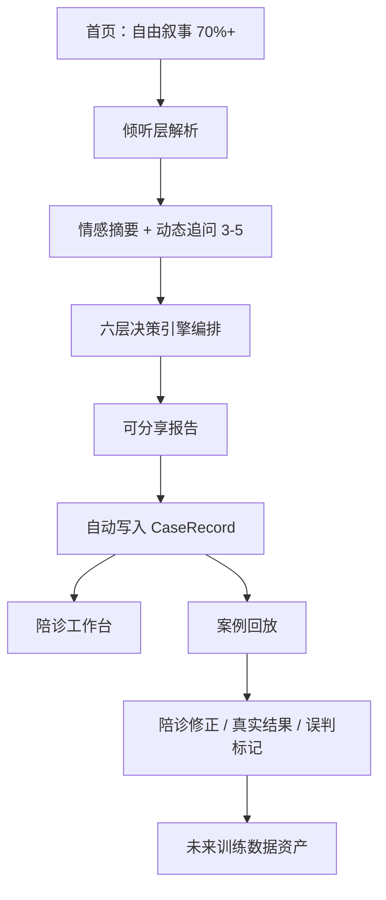

# 重构交付说明（医疗决策 AI 产品级）

## 1. 重构后的目录结构

```
xiangya-medical-advisor/
├── index.html
├── package.json
├── vite.config.ts
├── tsconfig.json
├── README.md
├── docs/
│   ├── 产品完整方案.md
│   └── 重构交付说明.md
└── src/
    ├── main.tsx
    ├── App.tsx
    ├── vite-env.d.ts
    ├── styles/app.css
    ├── models/types.ts                 # 能力标签、CaseRecord、DoctorProfile…
    ├── safety/medicalBoundary.ts       # 合规护栏
    ├── listening/
    │   ├── narrativeParser.ts
    │   ├── emotionalSummary.ts
    │   └── dynamicQuestionGenerator.ts
    ├── engines/
    │   ├── problemEngine.ts
    │   ├── stageEngine.ts
    │   ├── constraintEngine.ts
    │   ├── capabilityEngine.ts
    │   ├── matchingEngine.ts
    │   ├── explanationEngine.ts
    │   └── orchestrator.ts
    ├── repositories/
    │   ├── store.ts                    # Local / 预留远程适配
    │   ├── doctorRepository.ts
    │   ├── caseRepository.ts
    │   └── reportRepository.ts
    ├── data/doctors.seed.ts
    ├── state/
    │   ├── RepoProvider.tsx
    │   └── SessionProvider.tsx
    ├── components/AppShell.tsx
    └── pages/
        ├── HomeNarrativePage.tsx       # 自由叙事入口（视觉主体）
        ├── ListenFollowUpPage.tsx      # 倾听摘要 + 动态追问
        ├── ReportPage.tsx              # 可分享决策报告
        ├── WorkbenchPage.tsx           # 陪诊工作台
        └── CaseReplayPage.tsx          # 案例回放闭环
```

## 2. 新增文件清单

| 类别 | 文件 |
|------|------|
| 倾听层 | `narrativeParser.ts` `emotionalSummary.ts` `dynamicQuestionGenerator.ts` |
| 决策引擎 | `problem/stage/constraint/capability/matching/explanationEngine.ts` + `orchestrator.ts` |
| 数据层 | `doctor/case/reportRepository.ts` + `store.ts` |
| 模型/合规 | `models/types.ts` `safety/medicalBoundary.ts` |
| 页面 | Home / Listen / Report / Workbench / CaseReplay |
| 基建 | Vite+React+TS 全套配置 |

旧版 `js/` `css/` 静态脚本已移除（由 React 体系替代）。

## 3. 关键数据模型

### DoctorProfile

`id, name, hospital, department, title, capabilityTags[], evidence, evidenceLevel, firstVisitFriendly, externalPatientFriendly, conservativePreference, surgeryPreference, communicationStyle, lastVerifiedAt, uncertainty`

### CapabilityTag（枚举常量，禁止自由字符串）

含：`CBT / ACT / depression_management / complex_evaluation / minimally_invasive / conservative_treatment / surgery_decision / chronic_management / first_visit_support` 及专科方向标签。

### CaseRecord（闭环）

`initialNarrative, structuredNeeds, aiDecision, companionCorrection, finalDoctor, doctorActualAdvice, patientFinalChoice, estimatedCost, satisfactionScore, reducedTravelFlag, followUp30d, aiMisjudgmentReasons`

### AiDecision

含真实问题、倾听摘要、阶段、下一步、能力需求、匹配医生、排序逻辑、不确定性、可分享章节、**engineTrace（可追溯）**。

## 4. 页面流程图



原则：**AI 负责理解与表达，规则负责判断与排序。**

## 5. 哪些部分已经完成

- [x] 自由叙事入口（首页主体）
- [x] 倾听层三模块（规则实现，可替换 LLM）
- [x] 动态追问（非固定问卷）
- [x] 六层决策引擎 + orchestrator
- [x] Repository 数据访问层（LocalStorage，预留远程）
- [x] 医生模型标准化 + 能力标签枚举
- [x] 可分享 8 段式报告 + 打印/复制
- [x] 案例回放：痕迹、修正、结果回填、误判标记
- [x] 合规护栏统一拦截/改写
- [x] React+TS 可构建通过（`npm run build`）

## 6. 哪些部分仍需人工补充数据

| 项 | 说明 |
|----|------|
| 医生能力库核验 | `lastVerifiedAt`、CBT 等流派标签需对照官网/挂号平台人工确认 |
| 证据分级校准 | 当前多为 medium/weak，需运营补强 evidence |
| 院区/出诊日 | 未接号源；需人工或后续接口 |
| LLM 接入 | narrative/explanation 仍为规则模板；接 OpenAI 后替换接口即可 |
| 飞书/Supabase | `FutureRemoteStore` 已预留，未接线 |
| 陪诊修正结构化 | 现支持笔记；医生 ID 调整可再增强 UI |
| 全国医院扩展 | 模型已标准化，需按医院导入种子数据 |

## 启动

```bash
npm install
npm run dev
```
